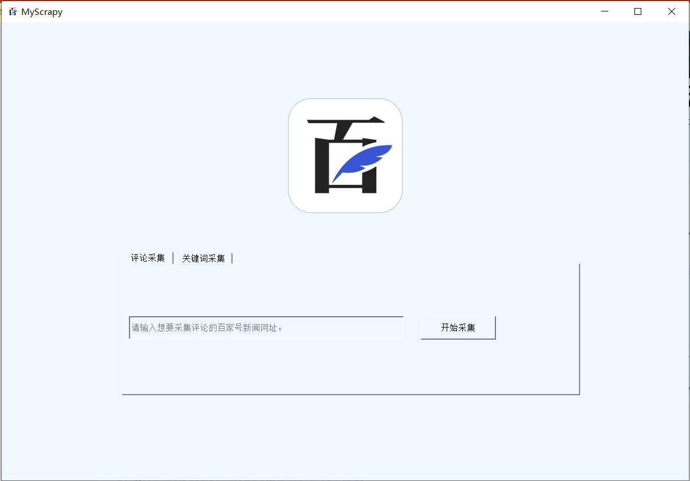

# Baidu Data Scraping - Baijiahao News

## Overview

This project aims to help users scrape data from the "百家号" news platform of Baidu. We use selenium and scrapy frame with python to build this web crawler. 

With this application, you can check the comments from the baijiahao links and get the links of recent hotspots by simply clicking the screen for several times, and get the persistent data in mongo database or export them as .csv files. The data in comments can also be sorted with their frequency with the wordcloud packages to give a visualized result for further analysis.

## Requirements

To build and run this crawler on your computer, python3 environment with the following packages (or applications) needs to be installed:

- scrapy, selenium frame
- chromedriver headless-browser
- mongodb database and pymongo package
- pyqt (version >= 5)
- wordcloud and imageio packages

Besides, the needed python packages have been listed in requirements.txt. You can install them with pip tools.

## Usage

Run the crawler in root folder by powershell command

```
python ./crawling/crawling/spiders/index.py
```

Then you can use the comment crawling and hotspots analysis functions from the GUI interface.



## Demo and Export

You can find the example data in the demo folder stored as .csv files. 

On top of this, to export results as csv files, try run the crawler with powershell commands

```
scrapy crawl <projectname> -o <output_filename>
```

The <projectname\> is \<baijiahao> for comment extraction and \<hotspots> for the hotspot links.

## Settings

You can manually modify the settings of this crawler by editing the settings.py and pipelines.py in the project folders in order to direct the data to your own databases and change the language encoding schemes.

The default database and encoding settings are listed as below:

```
'database': 'scrapy_db'
'address': 'localhost, 27017'
'encoding': 'UTF-8'
```


